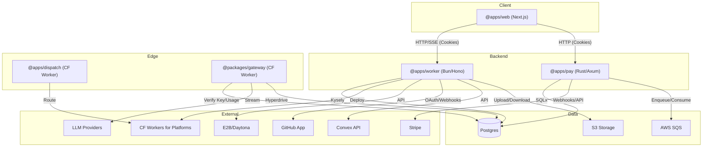

# Architecture

Surgent is a vibe coding platform that provides a complete environment for building and deploying applications. It handles development environments, AI agents, frontend/backend hosting, databases, and payments.

## System Overview

The following diagram illustrates the high-level architecture and communication patterns between services:

## Applications (@apps)

### @apps/web

- **Tech Stack**: Next.js 15
- **Purpose**: Main user interface for the platform.
- **Communication**:
  - Connects to the backend via `NEXT_PUBLIC_BACKEND_URL`.
  - Connects to the payment service via `NEXT_PUBLIC_PAY_URL`.
  - Uses `credentials: "include"` for all requests to ensure session cookies are sent.
  - Uses SSE (Server-Sent Events) via `EventSource` for real-time agent stream updates.

### @apps/worker

- **Tech Stack**: Bun + Hono
- **Deployment**: AWS ECS Fargate
- **Purpose**: Central backend API and orchestration engine.
- **Responsibilities**:
  - Authentication via Better Auth (cookie-based and API keys).
  - Database access through `@repo/db`.
  - Project management and sandbox orchestration (E2B/Daytona).
  - GitHub App integration and OAuth.
  - Convex team API management.
  - File uploads to S3-compatible storage.
  - Deployment of customer applications to Cloudflare Workers for Platforms.

### @apps/dispatch

- **Tech Stack**: Cloudflare Worker
- **Purpose**: Request router for customer deployments.
- **Functionality**: Routes incoming requests on `*.surgent.site/*` subdomains to the appropriate Cloudflare Dispatch namespace.
- **Note**: This service does not handle deployments; it only dispatches requests to already deployed workers.

### @apps/pay

- **Tech Stack**: Rust + Axum (Surpay)
- **Deployment**: AWS ECS Fargate
- **Purpose**: Billing and payment processing.
- **Responsibilities**:
  - Database access via SQLx (Postgres).
  - Stripe integration for payments and subscriptions.
  - Background processing of webhooks using AWS SQS.
  - Authentication via API keys or Better Auth session cookies.

## Packages (@packages)

### @packages/gateway

- **Tech Stack**: Cloudflare Worker
- **Purpose**: AI Gateway for LLM request proxying and usage tracking.
- **Functionality**:
  - Exposed via `/zen/*`.
  - Verifies API keys and proxies requests to LLM providers (OpenAI, Anthropic, Google).
  - Streams responses back to the client.
  - Tracks usage data into Postgres via Cloudflare Hyperdrive.
  - Utilizes Cloudflare KV and R2 for caching and storage.

### @packages/db

- **Purpose**: Shared database client and migration management.
- **Tech Stack**: Kysely
- **Support**: Postgres (including Neon).
- **Usage**: Shared by `@apps/worker` and `@packages/gateway`.

### @packages/util

- **Purpose**: Shared TypeScript utility functions used across the monorepo.

## Infrastructure (@infra)

The infrastructure is managed via AWS CDK and includes:

- **Compute**: AWS ECS Fargate for long-running services.
- **Container Registry**: AWS ECR.
- **Networking**: Application Load Balancer (ALB), ACM for SSL certificates.
- **Messaging**: AWS SQS for asynchronous task processing.
- **Secrets**: AWS SSM Parameter Store for secret management.
- **Storage**: S3-compatible storage for assets and uploads.
- **Edge**: Cloudflare Workers, KV, R2, Hyperdrive, and Workers for Platforms.

## Communication Patterns

- **Web to Worker**: Standard HTTP requests with session cookies. SSE is used for streaming agent responses.
- **Web to Pay**: HTTP requests with session cookies for billing operations.
- **Worker to Cloudflare**: Uses Cloudflare APIs to manage and deploy Workers for Platforms.
- **Worker to Sandboxes**: Communicates with E2B or Daytona APIs to manage ephemeral development environments.
- **Worker to GitHub**: Handles OAuth flows, GitHub App installations, and processes incoming webhooks.
- **Worker to Convex**: Manages team APIs and deployment environments.
- **Gateway to LLMs**: Proxies and streams requests to external providers.
- **Pay to Stripe**: Synchronous API calls and asynchronous webhook processing via SQS.

## Core Workflows

### Application Development

1. **Sandbox Provisioning**: When a user starts a project, the `@apps/worker` provisions an ephemeral development environment using E2B or Daytona.
2. **AI Orchestration**: The `@apps/web` frontend communicates with `@apps/worker` via SSE to stream agent updates. The worker coordinates with LLM providers through `@packages/gateway`.
3. **Code Persistence**: Code changes are managed via the GitHub App integration and stored in the project's workspace.

### Deployment and Routing

1. **Deployment**: The `@apps/worker` handles the build and deployment process, pushing the customer's application to Cloudflare Workers for Platforms.
2. **Routing**: Incoming requests to customer apps (e.g., `my-app.surgent.site`) are handled by `@apps/dispatch`, which routes them to the appropriate Cloudflare Dispatch namespace.

### Billing and Payments

1. **Subscription Management**: `@apps/web` interacts with `@apps/pay` to manage user subscriptions and credits.
2. **Event Processing**: Stripe webhooks are received by `@apps/pay`, enqueued in AWS SQS, and processed asynchronously to update user status and ledger.

## Database Architecture

Surgent uses **Postgres** as its primary data store.

- **Worker/Gateway**: Use `@packages/db` (Kysely) for type-safe queries.
- **Pay**: Uses SQLx for Rust-based database interactions.
- **Edge Access**: The AI Gateway uses Cloudflare Hyperdrive to maintain performant connections to the Postgres instance from the edge.

## Authentication

Surgent uses **Better Auth** as its authentication system with two authentication methods:

### Cookie-Based Auth (Internal)

Used for browser-based clients:

- `@apps/web` sends requests with `credentials: "include"` to attach session cookies.
- `@apps/worker` and `@apps/pay` validate session cookies via Better Auth.

### API Key Auth (External)

Used for programmatic access and customer apps:

- `@apps/worker` includes an API key plugin for generating and validating keys.
- `@apps/pay` accepts `Authorization: Bearer <key>` or `x-api-key` headers.
- `@packages/gateway` validates API keys for customer AI requests.

### Customer App Flow

When a customer deploys their app to Surgent:

1. The app is deployed to Cloudflare Workers for Platforms via `@apps/worker`.
2. Requests to `*.surgent.site` are routed by `@apps/dispatch` to the correct worker.
3. Customer apps can call `@packages/gateway` for AI completions using their API key.
4. Customer apps can call `@apps/pay` for billing operations using their API key.

## External Services

- **AWS**: ECS, ECR, ALB, SQS, SSM, ACM, S3.
- **Cloudflare**: Workers, KV, R2, Hyperdrive, Workers for Platforms.
- **Payments**: Stripe.
- **Development**: E2B, Daytona.
- **VCS**: GitHub.
- **Backend-as-a-Service**: Convex.
- **LLM Providers**: OpenAI, Anthropic, Google.

## Local Development

- **Package Management**: Use `bun` for all package management tasks.
- **Environment Variables**: Most apps require an `.env` file. Refer to `.env.example` in each application directory.
- **Database**: Ensure a Postgres instance is accessible. Migrations are managed in `@packages/db`.
- **Worker**: Run via `bun dev` in `apps/worker`.
- **Web**: Run via `bun dev` in `apps/web`.
- **Pay**: Requires a Rust environment. Run via `cargo run` in `apps/pay`.
